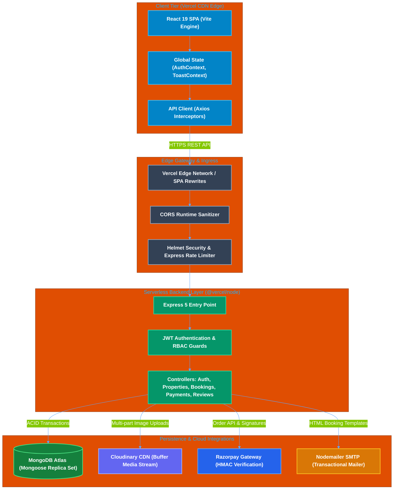
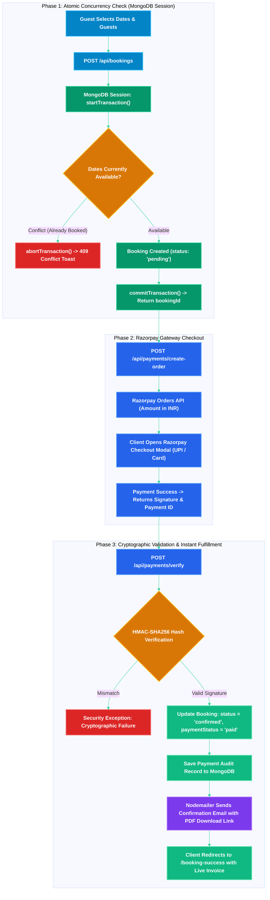
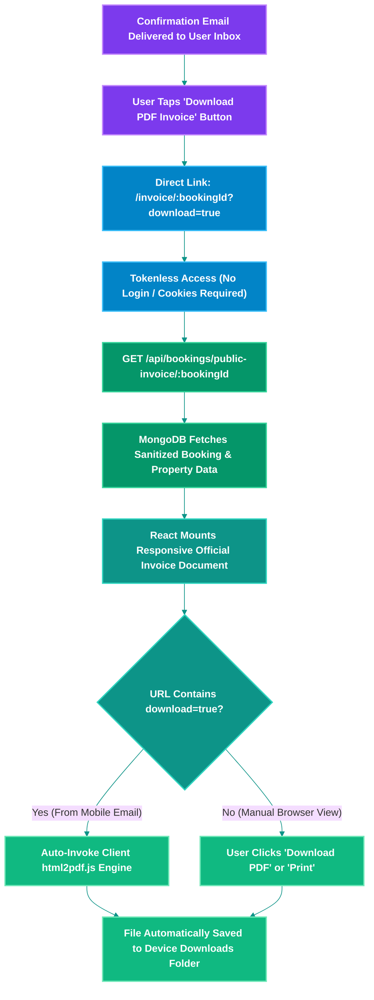
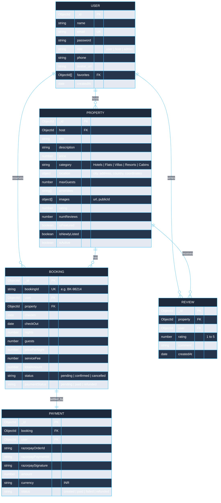

<div align="center">

# Homely

### Production-Grade Full-Stack Vacation Rental & Booking Platform

[](https://homely-gilt.vercel.app)
[](https://react.dev)
[](https://vitejs.dev)
[](https://nodejs.org)
[](https://expressjs.com)
[](https://www.mongodb.com)
[](https://razorpay.com)
[](https://cloudinary.com)
[](https://jwt.io)

<br/>

[**Live Application**](https://homely-gilt.vercel.app) &nbsp;•&nbsp; [**Backend API**](https://homely-server-nine.vercel.app) &nbsp;•&nbsp; [**Architecture**](#system-architecture) &nbsp;•&nbsp; [**Workflows**](#dynamic-workflows) &nbsp;•&nbsp; [**API Docs**](#api-reference) &nbsp;•&nbsp; [**Local Setup**](#local-development-setup)

<br/>

</div>

---

## Table of Contents

- [Architectural Overview](#architectural-overview)
- [System Architecture](#system-architecture)
- [Dynamic Workflows](#dynamic-workflows)
  - [1. Authentication & Role-Based Access Control Workflow](#1-authentication--role-based-access-control-workflow)
  - [2. Booking & Cryptographic Payment Lifecycle Workflow](#2-booking--cryptographic-payment-lifecycle-workflow)
  - [3. Favorites & Wishlist Synchronization Workflow](#3-favorites--wishlist-synchronization-workflow)
  - [4. Direct Mobile & Web Invoice Generation Workflow](#4-direct-mobile--web-invoice-generation-workflow)
- [Database Schema & Entity Relationship](#database-schema--entity-relationship)
- [Key Features](#key-features)
- [Tech Stack](#tech-stack)
- [Project Directory Structure](#project-directory-structure)
- [Environment Configuration](#environment-configuration)
- [Local Development Setup](#local-development-setup)
- [API Reference](#api-reference)
- [Security & Production Hardening](#security--production-hardening)
- [License](#license)

---

## Architectural Overview

Homely utilizes a decoupled client-server architecture deployed on **Vercel Serverless Functions** with **MongoDB Atlas**:
- **Client Tier**: React 19 Single Page Application powered by Vite, utilizing responsive Vanilla CSS design system tokens, glassmorphism, and optimistic state updates.
- **Server Tier**: Express 5 application structured with RESTful design patterns, layered controllers, middlewares, and serverless-compatible stateless routing.
- **Data & Transactions**: MongoDB Atlas with native multi-document ACID transactions ensuring zero race conditions during reservation checkouts.
- **Third-Party Integrations**:
  - **Razorpay**: Order creation, client checkout SDK, SHA-256 webhook and client signature verification.
  - **Cloudinary**: Multi-image buffer streaming without filesystem storage.
  - **Nodemailer**: SMTP transactional emails with direct one-click public invoice URLs.

---

## System Architecture



---

## Dynamic Workflows

### 1. Authentication & Role-Based Access Control Workflow

```mermaid
%%{init: {'theme': 'base', 'themeVariables': {'lineColor': '#38bdf8', 'textColor': '#ffffff'}}}%%
flowchart LR
    classDef startNode fill:#0284c7,stroke:#38bdf8,stroke-width:2px,color:#ffffff,font-weight:bold;
    classDef processNode fill:#1e40af,stroke:#60a5fa,stroke-width:2px,color:#ffffff,font-weight:bold;
    classDef decisionNode fill:#d97706,stroke:#fbbf24,stroke-width:2px,color:#ffffff,font-weight:bold;
    classDef successNode fill:#059669,stroke:#34d399,stroke-width:2px,color:#ffffff,font-weight:bold;
    classDef errorNode fill:#dc2626,stroke:#f87171,stroke-width:2px,color:#ffffff,font-weight:bold;
    classDef roleNode fill:#7c3aed,stroke:#c084fc,stroke-width:2px,color:#ffffff,font-weight:bold;

    A["User Inputs Credentials / OAuth"]:::startNode --> B["Frontend Auth Service (Axios)"]:::processNode
    B --> C["POST /api/auth/login"]:::processNode
    C --> D["MongoDB Query (Bcrypt Hash Validation)"]:::processNode
    D --> E{"Credentials Valid?"}:::decisionNode
    E -- "Invalid" --> F["401 Unauthorized -> In-App Toast Error"]:::errorNode
    E -- "Valid" --> G["Sign JWT Access Token"]:::successNode
    G --> H["Store in LocalStorage & Cookies"]:::successNode
    H --> I["Hydrate Global AuthContext"]:::processNode
    I --> J{"User Role Check"}:::decisionNode
    J -- "role: 'admin'" --> K["Admin Control Center (/admin)"]:::roleNode
    J -- "role: 'host'" --> L["Host Dashboard (/host)"]:::roleNode
    J -- "role: 'user'" --> M["Guest Booking & Wishlist (/favorites)"]:::roleNode
```



---

### 2. Booking & Cryptographic Payment Lifecycle Workflow



---

### 3. Favorites & Wishlist Synchronization Workflow

```mermaid
%%{init: {'theme': 'base', 'themeVariables': {'lineColor': '#f43f5e', 'textColor': '#ffffff'}}}%%
flowchart LR
    classDef clickNode fill:#e11d48,stroke:#fda4af,stroke-width:2px,color:#ffffff,font-weight:bold;
    classDef checkNode fill:#d97706,stroke:#fbbf24,stroke-width:2px,color:#ffffff,font-weight:bold;
    classDef warnNode fill:#ea580c,stroke:#fdba74,stroke-width:2px,color:#ffffff,font-weight:bold;
    classDef uiNode fill:#be185d,stroke:#f472b6,stroke-width:2px,color:#ffffff,font-weight:bold;
    classDef apiNode fill:#7c3aed,stroke:#c084fc,stroke-width:2px,color:#ffffff,font-weight:bold;
    classDef dbNode fill:#059669,stroke:#34d399,stroke-width:2px,color:#ffffff,font-weight:bold;
    classDef syncNode fill:#0284c7,stroke:#38bdf8,stroke-width:2px,color:#ffffff,font-weight:bold;

    A["User Clicks Heart Icon on Any Property Card"]:::clickNode --> B{"User Authenticated?"}:::checkNode
    B -- "No" --> C["In-App Toast: 'Please log in to save properties'"]:::warnNode
    B -- "Yes" --> D["Optimistic UI: Heart Immediately Turns Rose/Red"]:::uiNode
    D --> E["userService.addFavorite(propertyId)"]:::apiNode
    E --> F["POST /api/users/favorites"]:::apiNode
    F --> G["MongoDB: User.updateOne($addToSet: { favorites: id })"]:::dbNode
    G --> H["Sync Global AuthContext Favorites State"]:::syncNode
    H --> I["Property Instantly Displayed at /favorites"]:::syncNode
    H --> J["Navbar Wishlist Icon Count Updated"]:::syncNode
```



---

### 4. Direct Mobile & Web Invoice Generation Workflow



---

## Database Schema & Entity Relationship



---

## Key Features

| Domain | Capabilities |
|---|---|
| **Guest Experience** | Instant property search with category & price sorting, auto-playing image carousels, responsive modal lightbox, one-click wishlist toggling, and date calculation. |
| **Booking & Checkout** | Concurrency-safe double-booking prevention, Razorpay payments, automated transactional emails with booking confirmation details. |
| **Direct Invoicing** | Dedicated public invoice route (`/invoice/:id`) rendering printable receipts and client-side PDF generation (`html2pdf.js`) optimized for mobile devices without requiring sign-in. |
| **Host Ecosystem** | Become a Host upgrade flow, Host Dashboard for property creation with Cloudinary image streaming, listing management, and deletion confirm modals. |
| **Administration** | Admin Dashboard for user management (role assignments, user deletion), property visibility toggles, and system-wide revenue statistics. |
| **Modern UX/UI** | Zero browser alert/confirm popups (replaced with custom animated toasts and glassmorphic modals), CSS design system, and mobile-first layouts. |

---

## Tech Stack

### Frontend
- **Framework**: [React 19](https://react.dev/) + [Vite](https://vitejs.dev/)
- **Routing**: [React Router v7](https://reactrouter.com/)
- **Icons**: [React Icons](https://react-icons.github.io/react-icons/) (FontAwesome, Material Design)
- **PDF Generation**: [html2pdf.js](https://ekoopmans.github.io/html2pdf.js/)
- **HTTP Client**: [Axios](https://axios-http.com/) with JWT authorization interceptors
- **Styling**: Modular CSS tokens, flex/grid layouts, glassmorphic UI components

### Backend
- **Runtime**: [Node.js](https://nodejs.org/) (ES Modules)
- **Framework**: [Express 5](https://expressjs.com/)
- **Database**: [MongoDB Atlas](https://www.mongodb.com/) via [Mongoose ODM](https://mongoosejs.com/)
- **Payment Gateway**: [Razorpay Node SDK](https://razorpay.com/docs/)
- **Media CDN**: [Cloudinary SDK v2](https://cloudinary.com/documentation) + [Multer](https://github.com/expressjs/multer)
- **Email Delivery**: [Nodemailer](https://nodemailer.com/) (Ethereal test fallback + SMTP)
- **Security**: [Helmet](https://helmetjs.github.io/), [express-rate-limit](https://github.com/express-rate-limit/express-rate-limit), [bcryptjs](https://github.com/dcodeIO/bcrypt.js), [jsonwebtoken](https://github.com/auth0/node-jsonwebtoken)
- **Logging**: [Winston](https://github.com/winstonjs/winston) (Console in production/serverless; file rotation in local development)

---

## Project Directory Structure

```text
homely/
├── client/                           # React 19 Frontend SPA
│   ├── src/
│   │   ├── api/                      # Axios HTTP service abstraction
│   │   │   ├── adminService.js
│   │   │   ├── authService.js
│   │   │   ├── bookingService.js
│   │   │   ├── paymentService.js
│   │   │   ├── propertyService.js
│   │   │   └── userService.js
│   │   ├── components/               # Modular UI Components
│   │   │   ├── Footer/
│   │   │   ├── HeroBanner/
│   │   │   ├── Invoice/              # Formal Invoice Receipt Component
│   │   │   ├── Navbar/
│   │   │   ├── NewlyAddedProperties/
│   │   │   ├── PropertyListings/     # Popular Stays with carousel
│   │   │   └── SearchBar/
│   │   ├── context/                  # Global React Contexts
│   │   │   ├── AuthContext.jsx       # Session hydration & role state
│   │   │   ├── ToastContext.jsx      # In-App Toasts & Modal Confirms
│   │   │   └── Toast.css
│   │   ├── pages/                    # Route Views
│   │   │   ├── Admin/                # Admin Panel
│   │   │   ├── Booking/              # Razorpay checkout page
│   │   │   ├── BookingSuccess/       # Post-payment confirmation
│   │   │   ├── Favorites/            # Wishlist / Liked Properties
│   │   │   ├── Host/                 # Host Listing Dashboard
│   │   │   ├── MyBookings/           # User reservation history
│   │   │   ├── PropertyDetails/      # Detail view, reviews, date picker
│   │   │   ├── PublicInvoice/        # Direct Mobile & Web PDF Invoice
│   │   │   └── SearchResults/
│   │   ├── App.jsx                   # Central routing & modal coordination
│   │   └── main.jsx
│   ├── vercel.json                   # Frontend SPA rewrite rules
│   └── package.json
│
└── server/                           # Express 5 REST API Backend
    ├── config/                       # DB connection & Passport configuration
    ├── controllers/                  # Route business logic
    │   ├── adminController.js
    │   ├── authController.js
    │   ├── bookingController.js      # Transactions & public invoice
    │   ├── paymentController.js      # Razorpay order creation & HMAC check
    │   ├── propertyController.js
    │   ├── reviewController.js
    │   └── userController.js         # Profile, avatar, favorites
    ├── middleware/                   # Auth, Roles, Validation, Errors
    ├── models/                       # Mongoose Schemas (User, Property, etc.)
    ├── routes/                       # Express Route Handlers
    ├── utils/                        # Cloudinary, Email templates, Logger
    ├── server.js                     # Serverless entry point (exports app)
    ├── vercel.json                   # Serverless function configuration
    └── package.json
```

---

## Environment Configuration

### Backend Environment (`server/.env`)

```env
PORT=5000
NODE_ENV=production
MONGO_URI=mongodb+srv://<username>:<password>@cluster0.mongodb.net/homely?retryWrites=true&w=majority
CLIENT_URL=https://homely-gilt.vercel.app

# Authentication Secrets
JWT_SECRET=your_super_secret_jwt_key
JWT_EXPIRE=30d
COOKIE_SECRET=your_cookie_signing_secret
SESSION_SECRET=your_session_secret

# Razorpay Payment Gateway
RAZORPAY_KEY_ID=rzp_test_YourKeyId
RAZORPAY_KEY_SECRET=YourRazorpaySecret
RAZORPAY_WEBHOOK_SECRET=YourWebhookSecret

# Cloudinary CDN
CLOUDINARY_CLOUD_NAME=your_cloud_name
CLOUDINARY_API_KEY=your_api_key
CLOUDINARY_API_SECRET=your_api_secret

# SMTP Mail Server (Leave empty to use automated Ethereal test inbox)
SMTP_HOST=smtp.gmail.com
SMTP_PORT=465
SMTP_EMAIL=your_email@gmail.com
SMTP_PASSWORD=your_gmail_app_password
FROM_NAME="Homely Reservations"
FROM_EMAIL=noreply@homely.com
```

### Frontend Environment (`client/.env`)

```env
VITE_API_URL=https://homely-server-nine.vercel.app/api
VITE_RAZORPAY_KEY_ID=rzp_test_YourKeyId
```

---

## Local Development Setup

### Prerequisites
- Node.js 18+ and npm installed
- Local MongoDB running with a Replica Set (required for transactions) or MongoDB Atlas connection URI

### 1. Clone the Repository
```bash
git clone https://github.com/m4nish-dev/homely.git
cd homely
```

### 2. Backend Setup
```bash
cd server
npm install
cp .env.example .env    # Fill in your environment variables
npm run seed            # Seeds 20+ real-world properties across India
npm run dev             # Starts backend on http://localhost:5000
```

### 3. Frontend Setup
```bash
cd ../client
npm install
npm run dev             # Starts frontend on http://localhost:5173
```

---

## API Reference

### Auth & User (`/api/auth`, `/api/users`)
| Method | Endpoint | Access | Description |
|---|---|---|---|
| `POST` | `/api/auth/register` | Public | Register new user account |
| `POST` | `/api/auth/login` | Public | Authenticate user & return JWT token |
| `GET` | `/api/auth/me` | Private | Fetch logged-in user profile |
| `GET` | `/api/users/favorites` | Private | Fetch user's saved wishlist |
| `POST` | `/api/users/favorites` | Private | Save property to wishlist |
| `DELETE` | `/api/users/favorites/:id` | Private | Remove property from wishlist |
| `PUT` | `/api/users/become-host` | Private | Upgrade account role to `host` |

### Properties (`/api/properties`)
| Method | Endpoint | Access | Description |
|---|---|---|---|
| `GET` | `/api/properties` | Public | List properties (filter by location, category, price) |
| `GET` | `/api/properties/:id` | Public | Fetch property details with reviews |
| `POST` | `/api/properties` | Host / Admin | Create listing with multi-image Cloudinary upload |
| `DELETE` | `/api/properties/:id` | Host / Admin | Delete property listing |

### Bookings & Payments (`/api/bookings`, `/api/payments`)
| Method | Endpoint | Access | Description |
|---|---|---|---|
| `GET` | `/api/bookings/public-invoice/:id` | **Public** | Fetch booking invoice details for mobile/email links |
| `POST` | `/api/bookings` | Private | Create reservation with atomic availability check |
| `GET` | `/api/bookings/my-bookings` | Private | Retrieve current user's booking history |
| `POST` | `/api/payments/create-order` | Private | Initialize Razorpay payment order |
| `POST` | `/api/payments/verify` | Private | Verify HMAC-SHA256 signature and confirm booking |
| `POST` | `/api/payments/webhook` | Public | Server-to-server Razorpay webhook listener |

---

## Security & Production Hardening

- **Stateless Serverless Execution**: Server instance handles runtime buffering, exports standard Express app instance (`export default app`), and disables disk-based log writing in production to comply with read-only filesystems.
- **Strict Cryptographic Signatures**: Razorpay payments are validated via server-side HMAC-SHA256 hash checks (`crypto.createHmac`) prior to marking reservations as confirmed.
- **Cross-Origin Sanitization**: Runtime origin sanitization strips trailing slashes to prevent CORS mismatches between Vercel frontends and backends.
- **Database Safety**: Mongoose queries utilize parameterized inputs and `$addToSet` / `$pull` atomic modifiers to protect against injection and duplicate items.
- **Zero UI Disruption**: Eliminated browser modal blocks (`alert`, `confirm`) that exposed deployment domain strings, substituting an accessible, non-blocking toast notification stack.

---

## License

This project is licensed under the [ISC License](LICENSE).
Built for modern travel and vacation rental experiences.
